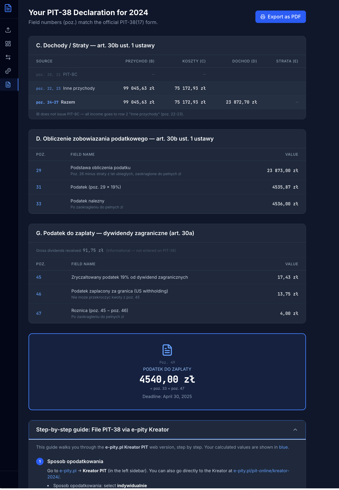

<p align="center">
  
</p>

<h1 align="center">Pitly</h1>

<p align="center">
  PIT-38 tax calculator for foreign stock investors in Poland.<br>
  Upload your broker statement CSV and get exact PIT-38 field values in seconds.
</p>

<p align="center">
  <a href="https://pitly.xyz"><strong>pitly.xyz</strong></a>
</p>

<p align="center">
  
  
  
</p>

---

## Why this exists

If you invest through a foreign broker from Poland, every year by **April 30** you must file a **PIT-38** tax declaration. This means manually converting dozens (or hundreds) of transactions to PLN using the correct NBP exchange rate, calculating capital gains with FIFO, figuring out dividend tax with foreign withholding credits, and filling in the right fields on the form. Doing this by hand is tedious, time-consuming, and error-prone.

**Pitly automates the entire process.** Upload your broker statement CSV and get the exact values to enter in your PIT-38 — in seconds, not hours.

> Supported brokers: **Interactive Brokers** and **Trading 212**.

## Features

- **One-click CSV import** — drag & drop one or more broker statements, the app merges prior years when FIFO history is needed
- **Automatic PLN conversion** — fetches official [NBP mid exchange rates](https://api.nbp.pl/) for every transaction date (last business day before, per Polish tax law)
- **FIFO capital gains calculation** — buy lots are queued per symbol, sells dequeue first-in-first-out to compute cost basis in PLN
- **Dividend tax with foreign credit** — calculates Polish 19% tax and offsets US withholding (typically 15% under the PL-US treaty)
- **Ready-to-use PIT-38 values** — generates exact amounts for fields C.20–C.24, D.25–D.26, E.27–E.28
- **Interactive dashboard** — summary cards, monthly bar chart, tax breakdown pie chart
- **Detailed transaction tables** — all trades and dividends with PLN conversion, filterable by symbol, sortable by any column
- **CSV export** — download your processed transactions for your records

## Screenshots

**Import** — drag & drop your CSV


**Dashboard** — capital gains, dividends, tax owed at a glance


**Transactions** — every trade with PLN conversion, filterable and sortable


**Dividends** — dividend payments with US withholding and net Polish tax


**PIT-38 Guide** — pre-filled field values ready to enter in e-Urzad Skarbowy



## Quick start with Docker

If you don't have Docker installed, download and install [Docker Desktop](https://www.docker.com/products/docker-desktop/) for your OS. Make sure it's running before proceeding.

```bash
docker-compose up --build
```

Open [http://localhost:3000](http://localhost:3000) in your browser. That's it.

When you're done, stop and remove the containers:

```bash
docker-compose down
```

## Manual setup

**Prerequisites:** [.NET 10 SDK](https://dotnet.microsoft.com/download), [Node.js 20+](https://nodejs.org/)

```bash
# Terminal 1 — Backend API
cd backend/src/Pitly.Api
dotnet run --launch-profile https
# https://localhost:7001

# Terminal 2 — Frontend
cd frontend
npm install && npm run dev
# http://localhost:5173
```

## How to export your broker statement

### Interactive Brokers

1. Log in to [IB Client Portal](https://www.interactivebrokers.com/sso/Login)
2. Go to **Performance & Reports > Statements**
3. Click **Activity** statement
4. Set the period to the full tax year (e.g. January 1 – December 31, 2024)
5. Select format: **CSV**
6. Upload the downloaded file in the app
7. If you became a Polish tax resident mid-year, still upload the full calendar-year CSV and set your residency start date in the app
8. If you sold shares bought in earlier years, upload those earlier yearly CSVs together so Pitly can reconstruct FIFO lots and stock splits

### Trading 212

1. Log in to Trading 212
2. Go to **History** (clock icon)
3. Click the **Download** icon
4. Select date range (full tax year) and export as CSV
5. If you became a Polish tax resident mid-year, still export the full calendar-year CSV and set your residency start date in the app
6. Upload the downloaded file in the app
7. Upload earlier yearly CSVs together when you need prior-year FIFO history

A sample IB statement is provided at [`samples/sample-activity-statement.csv`](samples/sample-activity-statement.csv) for testing.

## How it works

- **NBP exchange rates** — for each transaction, the app fetches the official mid rate from the last business day before the transaction date (per Polish tax law). Rates are cached in memory.
- **Capital gains (FIFO)** — buy lots are queued per symbol. On sell, lots are dequeued first-in-first-out to compute cost basis in PLN. Net gains are taxed at 19%.
- **Dividend tax** — Polish 19% tax minus foreign withholding credit (typically 15% under the PL-US treaty), resulting in ~4% net tax owed.

## API

| Method | Path | Description |
|--------|------|-------------|
| POST | `/api/import` | Upload CSV, returns session ID + results |
| GET | `/api/session/{id}/trades` | Paginated trades (sortable, filterable) |
| GET | `/api/session/{id}/dividends` | All dividends for session |
| GET | `/api/session/{id}/summary` | Tax summary totals |
| GET | `/api/session/{id}/pit38` | PIT-38 field values |
| GET | `/api/session/{id}/export/csv` | Export transactions as CSV |

## Tech stack

**Backend:** .NET 10, C#, Minimal API, EF Core, SQLite
**Frontend:** React 19, TypeScript, Vite, Tailwind CSS v4, Recharts
**External:** NBP API (no authentication required)

## Limitations

- Only **Stocks** trades — forex, options, futures, bonds, and crypto are not supported
- Only **USD** and **EUR** currencies
- If you sell a position opened in earlier years, upload those earlier yearly statements too so FIFO cost basis can be reconstructed correctly
- Loss carryforward from previous years must be applied manually
- Does not submit PIT-38 electronically — you enter the values yourself
- Always verify results and consult a tax advisor if unsure

## Support

If you find Pitly useful, consider buying me a coffee:

<a href="https://buymeacoffee.com/volodymyr_kovtun" target="_blank"></a>

## License

[MIT](LICENSE)
